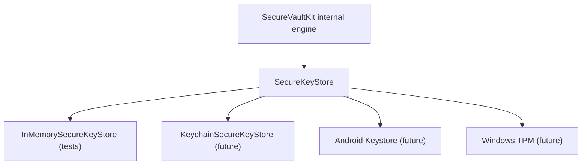

# Secure Key Storage Foundation

## Status

Foundation only

## Problem

Long-lived vault keys will eventually require platform-protected storage without coupling SecureVaultKit to one operating system or exposing key storage to application ViewModels.

## Solution

`SecureKeyStore` defines an asynchronous platform-neutral boundary for storing, loading, deleting, checking, and listing key metadata. The in-memory implementation exists only for tests. The Apple Keychain implementation is an explicit skeleton and does not persist keys yet.

## Security Boundaries

- Raw key material is returned only as runtime-only `SymmetricKeyMaterial`.
- Key listings expose metadata and key identifiers, never key bytes.
- No key material is stored in UserDefaults, logs, analytics, or plaintext files.
- Application Views and ViewModels must not access `SecureKeyStore` directly.
- Item and blob keys remain short-lived and wrapped according to the envelope encryption architecture.

## Tradeoffs And Risks

- The in-memory store provides no at-rest protection and must remain test/support infrastructure.
- Access-policy cases are semantic until each platform adapter maps them to reviewed native controls.
- The Keychain skeleton intentionally fails all operations until a production implementation and security review are completed.
