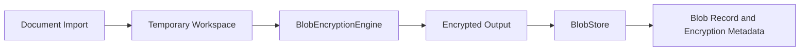
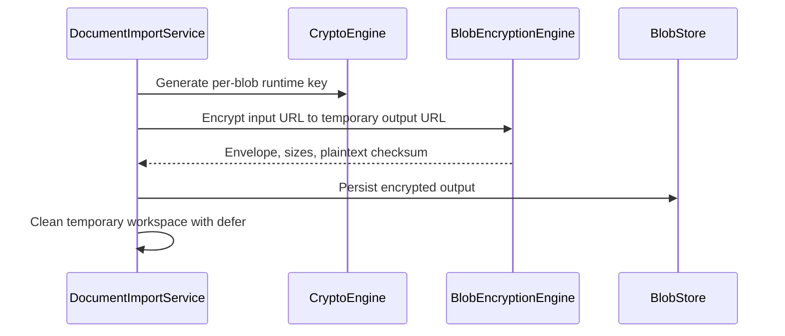

# Encrypted Blob Streaming Architecture

## Status

Milestone 23 foundation.

## Problem

Documents, originals, thumbnails, and previews can exceed safe in-memory sizes. Blob processing must avoid whole-file allocations, preserve temporary-file cleanup, and maintain the encrypt-before-persistence boundary.

## Solution

`BlobEncryptionEngine` owns file-to-file encryption and decryption. `BlobEncryptionPolicy` bounds chunk and file sizes. The fake engine applies a reversible non-plaintext transform in bounded chunks and emits a fake versioned envelope for tests; `RealBlobEncryptionEngine` explicitly remains unimplemented until an authenticated streaming construction is approved.

## Import Sequence

## Checksum Semantics

The checksum is lowercase SHA-256 over the complete plaintext input. It is computed incrementally in policy-sized chunks. It supports post-decryption content verification and is not a substitute for authenticated encryption. The fake engine reports this checksum but provides no confidentiality or authenticity.

## Security Boundaries

- File-URL staging, checksum calculation, fake transformation, and filesystem persistence use bounded chunks.
- Plaintext and encrypted intermediate files remain in `TemporaryWorkspace`, which is removed with `defer` after import.
- Blob keys are runtime-only and are not exposed through `VaultEngine` or application APIs.
- The real engine throws `CryptoError.notImplemented`; transformed fake output must never be represented as production encryption.
- Production blob-key wrapping and persisted wrapped-key metadata remain required before real streaming encryption ships.

## Tradeoffs And Risks

- The fake engine's reversible transform is suitable only for tests and architectural integration. It provides no confidentiality or authenticity.
- SHA-256 detects accidental content changes but does not authenticate ciphertext.
- Blob persistence and object/event persistence do not yet share one cross-filesystem transaction.
- The legacy `Data` BlobStore API remains for compatibility; large production files must use the encrypted file-URL path.
