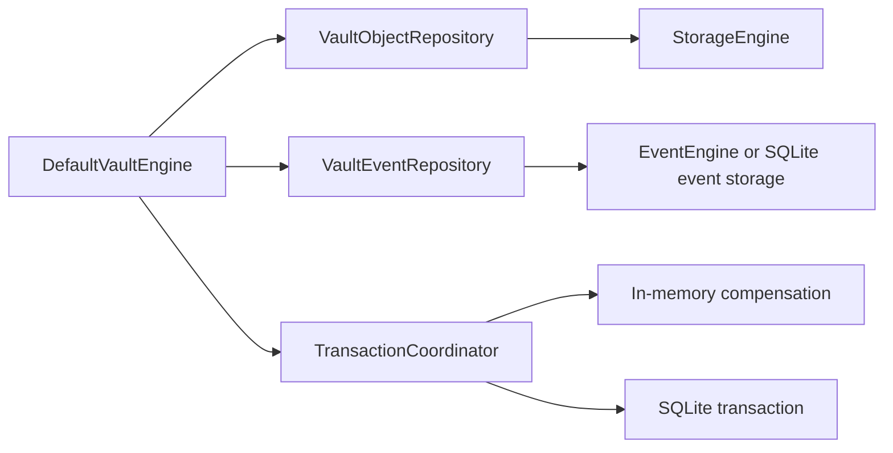
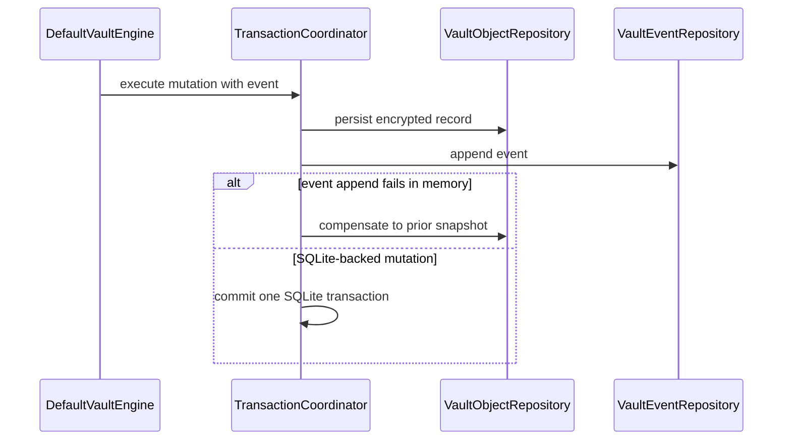

# Repository and Transaction Architecture

## Status

Accepted for Milestone 22.

## Problem

`DefaultVaultEngine` previously coordinated object persistence and event ordering directly through `StorageEngine` and `EventEngine`. That made mutation boundaries difficult to audit and prevented SQLite from guaranteeing that an object mutation and its event were committed together.

## Architecture

Repositories expose encrypted persistence records, not plaintext-only domain models. Public use cases continue to depend only on `VaultEngine`; repositories remain internal to `SecureVaultKit` and have no UI framework dependencies.

## Mutation Ordering

The in-memory coordinator always applies storage before appending an event and performs best-effort compensation if event append fails. The SQLite coordinator delegates to `SQLiteStorageEngine`, which executes the object mutation and event insert in one database transaction.

## Boundaries

- Vault header creation remains on `StorageEngine`; a vault repository is outside this milestone.
- Blob and device repositories establish the abstraction boundary but existing flows are only migrated where practical.
- Pending event queries currently return all vault events because sync state is not modeled yet.
- SQLite types and transaction details remain inside the infrastructure/storage implementation.

## Risks

- In-memory compensation cannot provide durability and may fail independently; it is intended for fake/test flows only.
- Blob file writes and database metadata cannot yet share a single atomic transaction.
- Production retry, idempotency, and event delivery state require future sync architecture.
