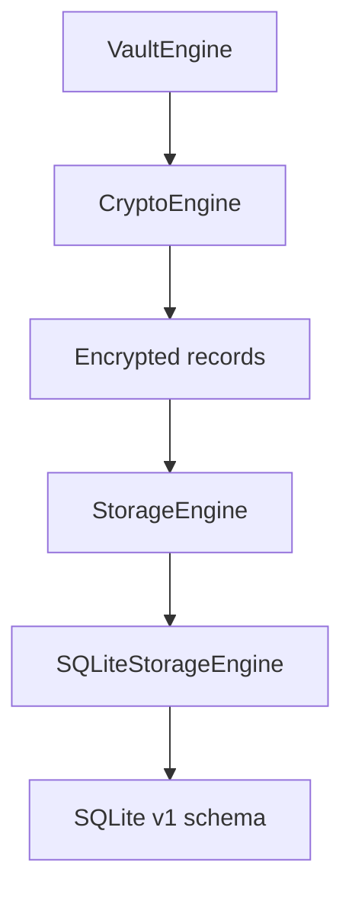
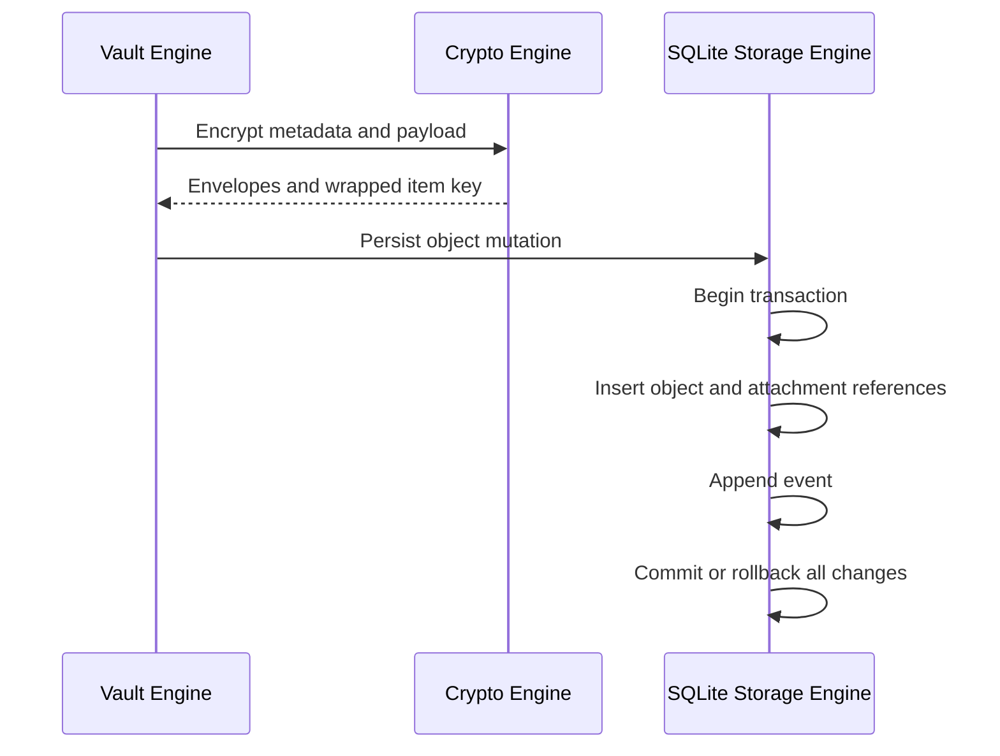

# SQLite Storage Architecture

## Status

Milestone 21 foundation

## Problem

SecureVaultKit needs durable local storage without allowing SQLite, application code, or future backend systems to observe plaintext vault content.

## Solution

`SQLiteStorageEngine` implements the existing internal `StorageEngine` contract. Version 1 creates tables for vault headers, encrypted objects, attachment references, events, trusted devices, and blob records.

Object metadata, payloads, and wrapped item keys are encoded into BLOB columns only after encryption or wrapping. Attachment rows contain only object ID, blob ID, and role; plaintext filenames remain inside encrypted object payloads.

## Mutation Flow

## Security Boundaries

- No plaintext title, tags, notes, payload fields, filenames, or document identifiers are schema columns.
- Object-level encryption remains mandatory; SQLite is not treated as an encryption boundary.
- SQL values are bound parameters except fixed migration constants.
- Storage access remains internal to SecureVaultKit.
- In-memory engines remain available for isolated tests.

## Tradeoffs And Risks

- Version 1 is a foundation, not a complete production migration strategy.
- GRDB is approved by ADR-010, but the current adapter uses platform SQLite 3 because the dependency could not be resolved in the implementation environment.
- Database-file encryption is not included and would provide defense in depth only; it cannot replace envelope encryption.
- Event, device, and blob persistence APIs are present but are not yet wired into every runtime engine configuration.
