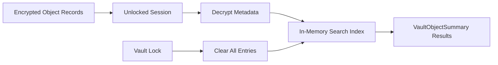
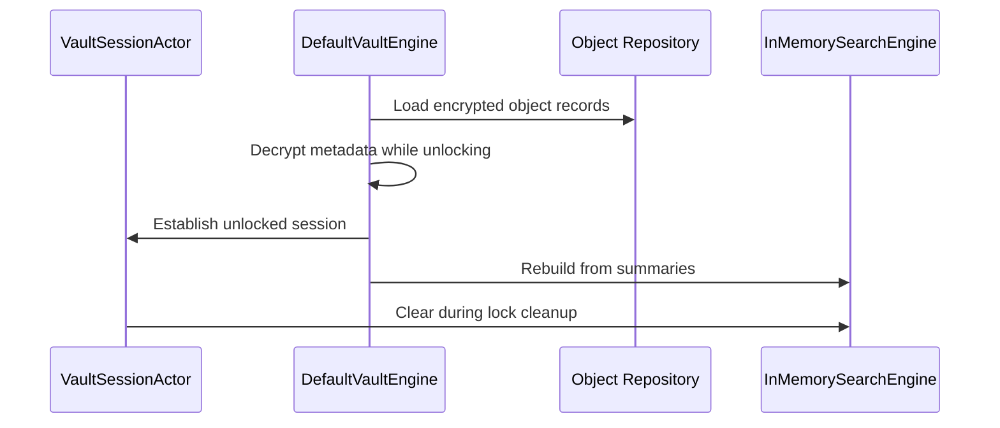

# Search Index Architecture

## Status

Milestone 24 foundation.

## Problem

Search requires decrypted titles, tags, and object types, but persisting that material would bypass object encryption and expose sensitive metadata while the vault is locked.

## Solution

`InMemorySearchEngine` owns `SearchIndexEntry` values only during an unlocked vault session. It never writes entries, searchable text, or queries to SQLite, files, UserDefaults, logs, analytics, or a server. Unlock decrypts object metadata and rebuilds the complete runtime index; lock clears every entry through the session cleanup handler.

## Lifecycle

## Policy

The active `SearchIndexPolicy` uses `inMemoryOnly`, rebuilds on unlock, clears on lock, and excludes deleted objects by default. `encryptedPersistentFuture` is a reserved policy value only; it has no persistence implementation and must not be selected as evidence that encrypted persistent search exists.

An empty or whitespace-only query returns all entries visible under the supplied filter. This supports the existing All Items workflow. Filters can restrict object types and can explicitly include deleted entries for internal trash workflows.

## Security Boundaries

- `searchableText` is generated and retained only inside a runtime `SearchIndexEntry`.
- Search fails through `VaultEngine` unless `VaultSessionActor` confirms an unlocked session.
- Deleted entries are excluded by default and active trash operations remove them from the index.
- No plaintext search index is persisted, backed up, synchronized, or sent to a server.
- Search query contents are not logged.
- Search types remain internal to SecureVaultKit; application code uses `VaultEngine`.

## Tradeoffs And Risks

- Unlock cost grows with the number of objects because metadata must be decrypted and re-indexed.
- Search results are unavailable until rebuild completes.
- Memory usage grows with searchable metadata while unlocked.
- Persistent encrypted search requires a future security design and approved architecture decision.
