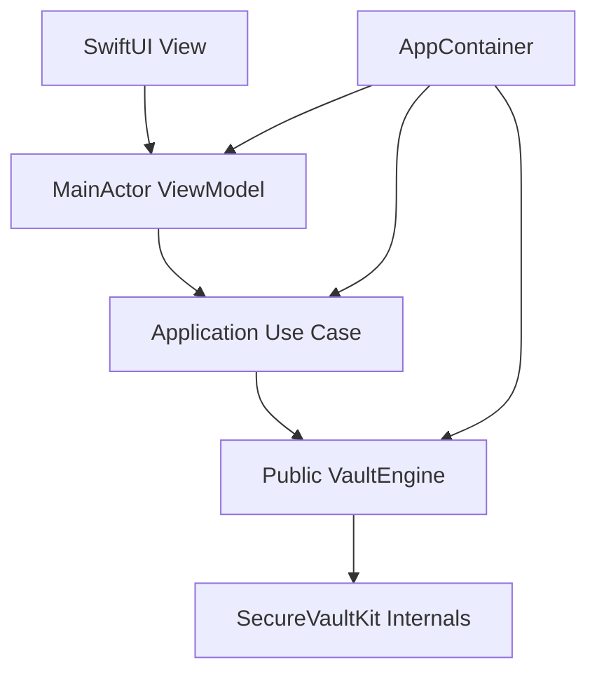
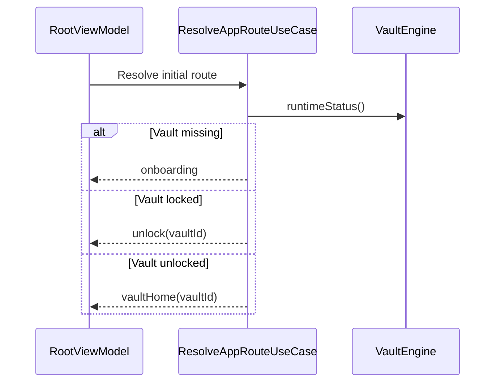
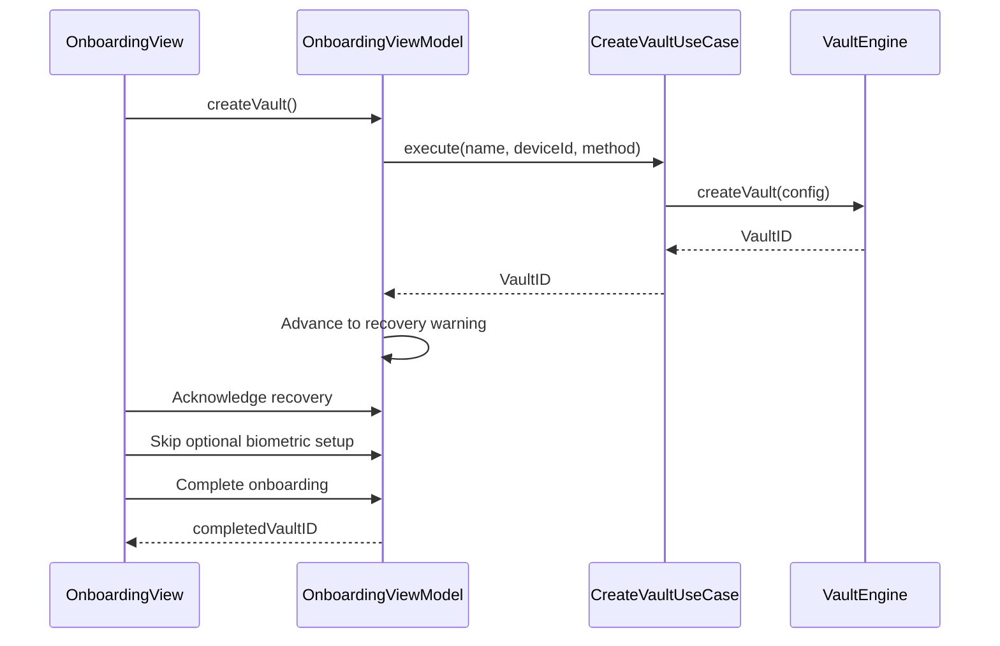
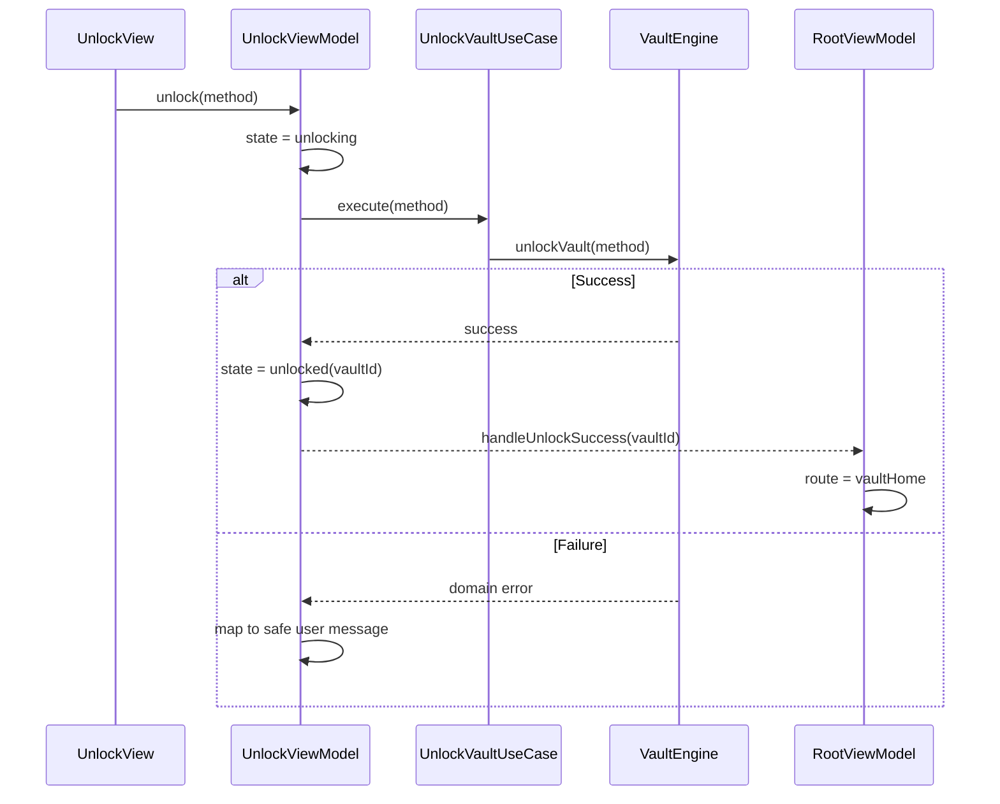
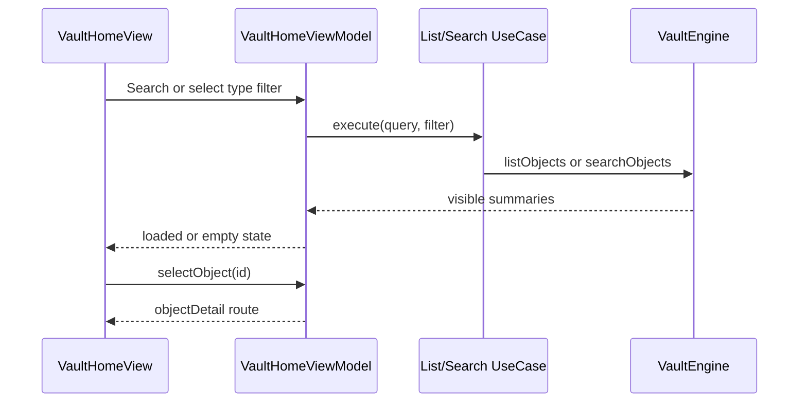
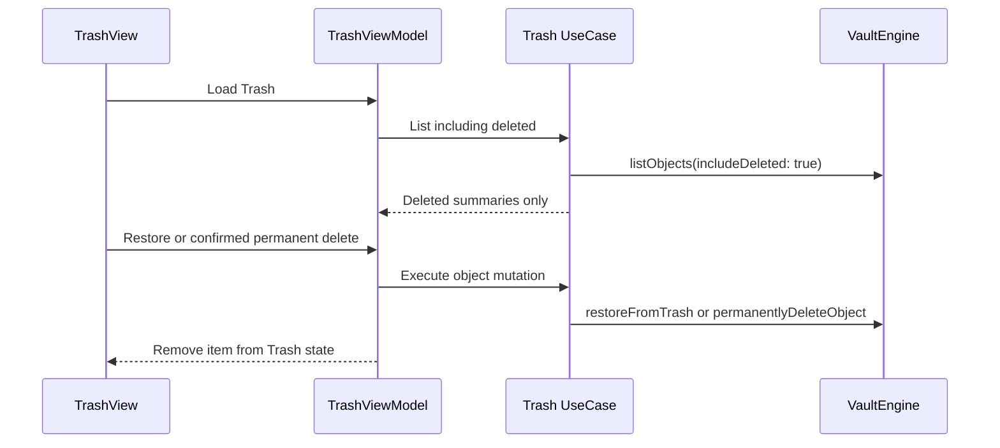
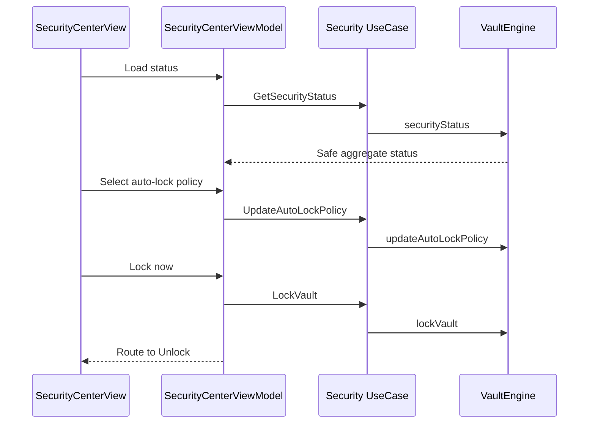
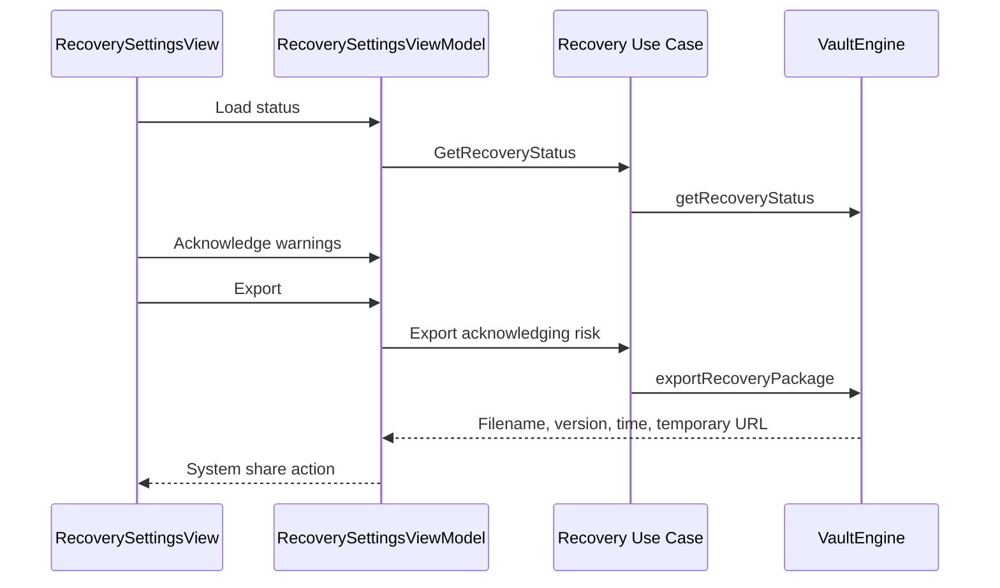

# iOS Application Architecture

## Status

Milestone 25 source foundation. No Xcode app project or workspace exists yet.

## Problem

The iOS application needs an initial SwiftUI shell without moving vault, storage, cryptography, or blob behavior out of SecureVaultKit. It also needs testable navigation and presentation state before production dependency composition and signing are available.

## Architecture

`AppContainer` owns one engine instance created by an injected factory and wires all use cases. There is no global mutable container. Views render published state and forward actions; view models know only use-case protocols; use cases know only the public `VaultEngine` protocol.

## Root Flow

The public runtime status exposes only vault presence, lock state, and vault identity. It does not expose session keys or SecureVaultKit services.

## Onboarding Flow

`OnboardingView` renders `OnboardingState` and forwards user actions to `OnboardingViewModel`. The view model owns `OnboardingStep` navigation and invokes `CreateVaultUseCase`; only that use case calls `VaultEngine.createVault(config:)`.

Creation success and onboarding completion are separate state transitions. This prevents root navigation from bypassing the mandatory recovery warning. The biometric/passkey screen is presentation-only and performs no authentication or platform API calls.

## Unlock Flow

`UnlockView` renders the explicit `UnlockState` values `idle`, `unlocking`, `unlocked`, and `failed`. It forwards biometric, passkey, and recovery-placeholder actions to `UnlockViewModel`. The view model invokes `UnlockVaultUseCase`; only the use case calls `VaultEngine.unlockVault(method:)`.

The app never handles credentials, session keys, or cryptographic material.
Biometric unlock is implemented inside SecureVaultKit through an internal
provider backed by `LocalAuthentication` on supported Apple platforms. The
ViewModel still calls only `UnlockVaultUseCase`; it never imports
`LocalAuthentication` or receives `LAContext`. Cancellation, unavailable,
failure, and lockout outcomes are mapped to user-safe domain messages. Passkey,
recovery package import, and recovery-secret entry remain deferred.

## Vault Home

`VaultHomeView` renders an explicit loading, loaded, empty, or error state. It forwards search text, type-filter selection, object selection, and add actions to `VaultHomeViewModel`. The view model invokes `ListVaultObjectsUseCase` for an empty query and `SearchVaultUseCase` for a non-empty query. Both use cases apply a `VaultObjectFilter` with deleted items excluded.

Search remains available only while the vault is unlocked and uses SecureVaultKit's local in-memory index. The app receives public summaries, never search entries or repository records. Document and photo summaries are treated as thumbnail candidates; each thumbnail request runs independently and never blocks the object list.

## Object Detail

`ObjectDetailView` loads a selected object through `ObjectDetailViewModel` and `GetObjectDetailUseCase`. Moving an item to Trash follows the same path through `MoveObjectToTrashUseCase`. Thumbnail display uses `LoadThumbnailUseCase`, which calls only the public `VaultEngine.loadThumbnail(for:)` API. The screen receives public domain details, attachment descriptors, and display-safe thumbnail bytes; it never reads blobs or requests keys.

Secure text values are masked in renderable state by default. The view model retains them only for the active loaded detail and places a value into rendered state after an explicit reveal action. Moving the object to Trash clears those retained values and transitions to a terminal moved state. Edit routes identity and card objects to their respective editors; editors for other object types remain future milestones.

## Identity Editor

`IdentityEditorView` supports create and edit modes through `IdentityEditorViewModel`. Create and update operations are isolated in `CreateIdentityUseCase` and `UpdateIdentityUseCase`; edit loading reuses `GetObjectDetailUseCase`. The use cases map the generic object model without introducing identity-specific storage.

Identity category is stored in generic metadata, while identity fields remain in the encrypted payload. Document numbers use `VaultFieldValue.secureText`, the editor uses a masked input control, and Object Detail requires explicit reveal. Form values remain transient app state and are never logged or persisted by the app layer.

## Card Editor

`CardEditorView` follows the same create/edit boundary through `CardEditorViewModel`, `CreateCardUseCase`, `UpdateCardUseCase`, and the public `VaultEngine`. Card category uses generic metadata; cardholder, issuer, optional expiry components, and card number use the encrypted generic payload.

Card numbers are mapped to `VaultFieldValue.secureText`, entered through a masked control, and hidden by default on Object Detail. The app does not persist or log form values and provides no payment, autofill, scanning, or attachment behavior. Vault Home exposes Identity, Card, and document-import choices through its Add menu.

## Document Import

`DocumentImportView` presents the platform file picker for one PDF, JPG/JPEG, or PNG file and forwards selection results to `DocumentImportViewModel`. The view model requests file inspection and import through `ImportDocumentUseCase`; that use case calls only `VaultEngine.importDocument` and never accesses blob, crypto, or storage services.

The UI retains only the selected URL and non-content file information while the flow is active. SecureVaultKit validates and stages the file, creates encrypted original and derivative blobs, creates the Document object and attachment references, then removes its temporary workspace. Thumbnail and preview failures are non-blocking. Success routes to Object Detail; unsupported and infrastructure errors are mapped to user-safe messages.

## Thumbnail Rendering

Vault Home and Object Detail request thumbnails asynchronously through
`LoadThumbnailUseCase`. View models publish loading, loaded, or placeholder
presentation state. Missing or failed thumbnails remain a local placeholder and
do not replace the screen's object state with an error.

Thumbnail bytes are held only in view-model state and SecureVaultKit's
in-memory cache. Locking clears the engine cache, and subsequent requests fail
until the vault is unlocked. The iOS app does not access `BlobStore`,
`CryptoEngine`, `StorageEngine`, blob identifiers, or decrypted file paths.

## Trash Experience

`TrashView` renders `TrashState` and forwards load, restore, policy purge, and
per-item permanent-delete actions to `TrashViewModel`. The view model depends
only on `ListTrashObjectsUseCase`, `RestoreFromTrashUseCase`,
`PurgeTrashUseCase`, and `PermanentlyDeleteObjectUseCase`; those use cases call
only public `VaultEngine` APIs.

Permanent deletion is available only for an object already in Trash and
appends an `object_purged` event transactionally with record removal. The UI
requires confirmation and labels the action irreversible. `Purge Expired`
delegates to SecureVaultKit's 30-day retention policy. Restored objects return
to normal listing and the in-memory search index.

## Settings And Security Center

`SettingsView` is a sectioned navigation hub backed by `SettingsViewModel` and
`GetSecurityStatusUseCase`. `SecurityCenterView` displays lock state, auto-lock
policy, placeholder authentication status, recovery readiness, and read-only
trusted-device summaries. Mutations flow through
`UpdateAutoLockPolicyUseCase` and the existing `LockVaultUseCase`.

The public security status contains no session, key, certificate, signature,
permission, or device public-key material. Trusted-device summaries expose only
device identity metadata needed for display. Recovery reports `incomplete`
until recovery generation is integrated with the vault lifecycle. Biometric
status reflects whether the configured platform provider can evaluate its
policy; passkey remains `notConfigured`. Auto-lock policy changes are runtime-only
in this foundation and are not persisted by the iOS app.

## Recovery Package Export

`RecoverySettingsView` renders recovery status, the required responsibility
acknowledgment, export progress, success metadata, and user-safe failures.
`RecoverySettingsViewModel` calls only `GetRecoveryStatusUseCase` and
`ExportRecoveryPackageUseCase`; those use cases call public `VaultEngine` APIs.

Acknowledgment is enforced by the view model and engine. SecureVaultKit creates
the versioned JSON artifact in temporary storage and removes its active copy on
lock. The app receives no package bytes, recovery secret, keys, payloads, blobs,
or internal recovery service. Recovery remains visibly incomplete until a
secret-backed setup milestone is implemented.

## Source Layout

The source-only shell lives under `ios/AegisVault/`:

- `App`: composition, routing, root flow, and the SwiftUI `App` type.
- `Application/UseCases`: intent-based wrappers around `VaultEngine`.
- `Presentation`: screen state, MainActor view models, and minimal views.
- `DesignSystem`: reserved component, token, and style boundaries.
- `Tests`: view-model, use-case, mock-engine, and dependency-boundary tests.

## Xcode Integration

No `.xcodeproj` exists, so this milestone intentionally does not create one. When the app project is introduced:

1. Create an iOS 17 application target named `AegisVault` and unit-test target named `AegisVaultTests`.
2. Add the local package at `packages/SecureVaultKit` and link the `SecureVaultKit` library product.
3. Add `ios/AegisVault`, excluding `Tests`, to the app target; add `ios/AegisVault/Tests` to the test target.
4. Add a minimal `@main App` entry point whose `WindowGroup` renders `AegisVaultApp(engineFactory:)`.
5. Supply that shell with SecureVaultKit's reviewed live composition factory once persistent device, event, blob, and key-storage implementations are ready.
6. Update Fastlane `test_ios` and `build` only after the scheme is shared.

The app must not construct internal SecureVaultKit dependencies. Until a public live composition factory exists, previews and tests should inject a `VaultEngine` mock or approved test engine.

## Tradeoffs And Risks

- The source shell cannot be compiled as an iOS target until an Xcode project and live engine composition entry point exist.
- Navigation placeholders intentionally contain no vault operations.
- App launch routing depends on `VaultEngine.runtimeStatus()` and fails closed if status cannot be loaded.
- Final visual design, accessibility review, scene-phase locking, privacy shielding, and file import UI remain future milestones.
