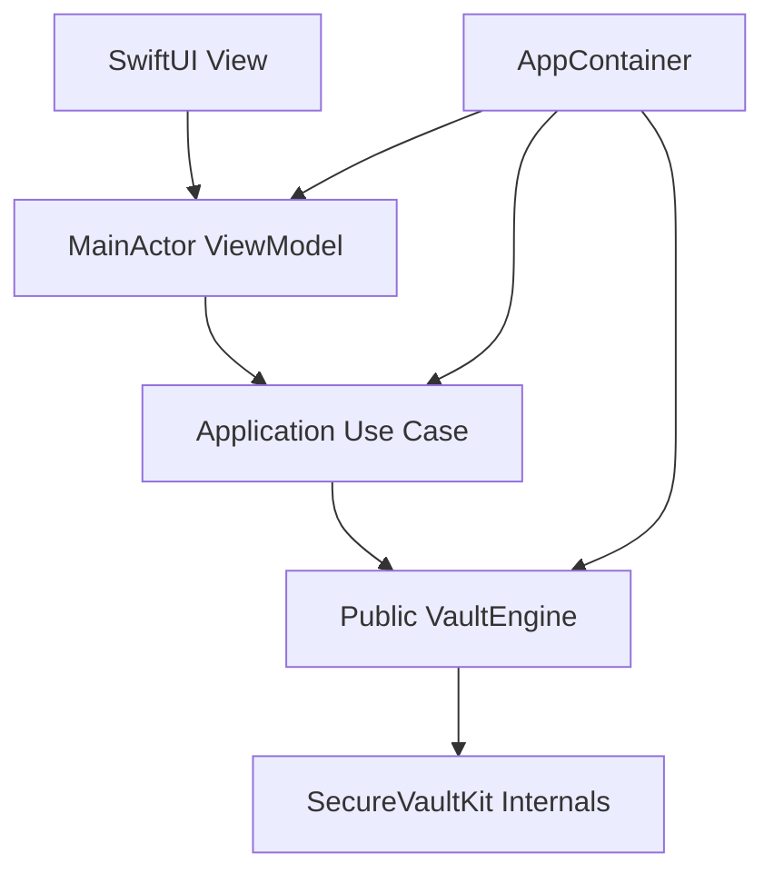
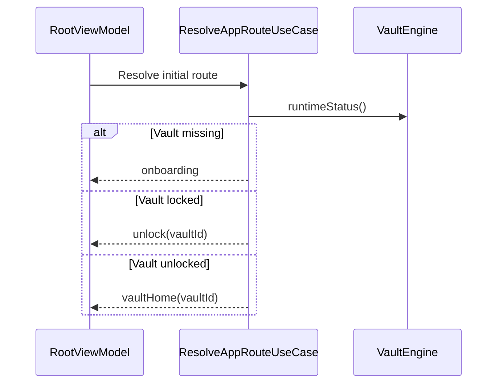

# iOS Application Architecture

## Status

Milestone 25 source foundation. No Xcode app project or workspace exists yet.

## Problem

The iOS application needs an initial SwiftUI shell without moving vault, storage, cryptography, or blob behavior out of SecureVaultKit. It also needs testable navigation and presentation state before production dependency composition and signing are available.

## Architecture

`AppContainer` owns one engine instance created by an injected factory and wires all use cases. There is no global mutable container. Views render published state and forward actions; view models know only use-case protocols; use cases know only the public `VaultEngine` protocol.

## Root Flow

The public runtime status exposes only vault presence, lock state, and vault identity. It does not expose session keys or SecureVaultKit services.

## Source Layout

The source-only shell lives under `ios/AegisVault/`:

- `App`: composition, routing, root flow, and the SwiftUI `App` type.
- `Application/UseCases`: intent-based wrappers around `VaultEngine`.
- `Presentation`: screen state, MainActor view models, and minimal views.
- `DesignSystem`: reserved component, token, and style boundaries.
- `Tests`: view-model, use-case, mock-engine, and dependency-boundary tests.

## Xcode Integration

No `.xcodeproj` exists, so this milestone intentionally does not create one. When the app project is introduced:

1. Create an iOS 17 application target named `AegisVault` and unit-test target named `AegisVaultTests`.
2. Add the local package at `packages/SecureVaultKit` and link the `SecureVaultKit` library product.
3. Add `ios/AegisVault`, excluding `Tests`, to the app target; add `ios/AegisVault/Tests` to the test target.
4. Add a minimal `@main App` entry point whose `WindowGroup` renders `AegisVaultApp(engineFactory:)`.
5. Supply that shell with SecureVaultKit's reviewed live composition factory once persistent device, event, blob, and key-storage implementations are ready.
6. Update Fastlane `test_ios` and `build` only after the scheme is shared.

The app must not construct internal SecureVaultKit dependencies. Until a public live composition factory exists, previews and tests should inject a `VaultEngine` mock or approved test engine.

## Tradeoffs And Risks

- The source shell cannot be compiled as an iOS target until an Xcode project and live engine composition entry point exist.
- Navigation placeholders intentionally contain no vault operations.
- App launch routing depends on `VaultEngine.runtimeStatus()` and fails closed if status cannot be loaded.
- Final visual design, accessibility review, scene-phase locking, privacy shielding, and file import UI remain future milestones.
